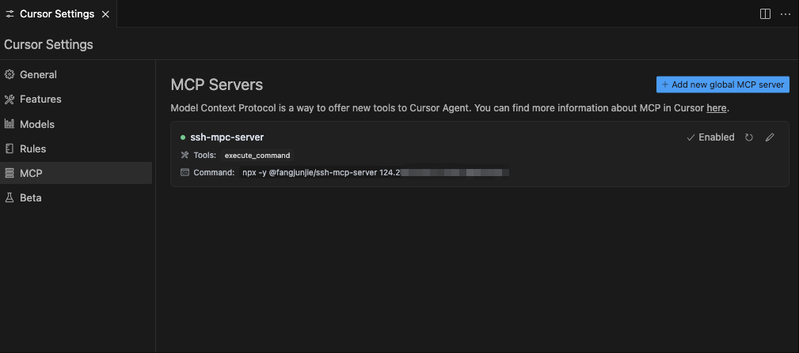
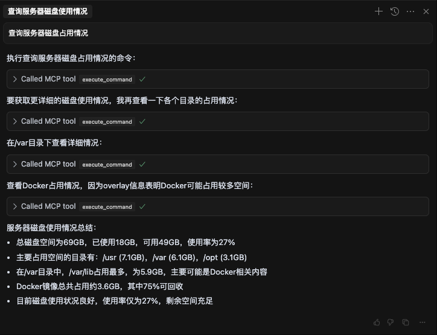

# ssh-mcp-server

基于 SSH 的 MCP (Model Context Protocol) 服务器，允许通过 MCP 协议远程执行 SSH 命令。

## 项目介绍

ssh-mcp-server 是一个桥接工具，可以让 AI 助手等支持 MCP 协议的应用通过标准化接口执行远程 SSH 命令。这使得 AI 助手能够安全地操作远程服务器，执行命令并获取结果，而无需直接暴露 SSH 凭据给 AI 模型。

## 工具列表

| 工具 | 名称 | 描述 |
|---------|-----------|----------|
| execute-command | 命令执行工具 | 在远程服务器上执行 SSH 命令并获取执行结果 |
| upload | 文件上传工具 | 将本地文件上传到远程服务器指定位置 |

## 使用方法

### MCP 配置示例

#### 命令行选项

```text
选项:
  -h, --host      SSH 服务器主机地址
  -p, --port      SSH 服务器端口
  -u, --username  SSH 用户名
  -w, --password  SSH 密码
  -k, --privateKey SSH 私钥文件路径
  -P, --passphrase 私钥密码（如果有的话）
  -?, --help      显示帮助信息
```

#### 使用密码

```json
{
  "mcpServers": {
    "ssh-mpc-server": {
      "command": "npx",
      "args": [
        "-y",
        "@fangjunjie/ssh-mcp-server",
        "--host 192.168.1.1",
        "--port 22",
        "--username root",
        "--password pwd123456"
      ]
    }
  }
}
```

#### 使用私钥

```json
{
  "mcpServers": {
    "ssh-mpc-server": {
      "command": "npx",
      "args": [
        "-y",
        "@fangjunjie/ssh-mcp-server",
        "--host 192.168.1.1",
        "--port 22",
        "--username root",
        "--privateKey ~/.ssh/id_rsa"
      ]
    }
  }
}
```

#### 使用带密码私钥

```json
{
  "mcpServers": {
    "ssh-mpc-server": {
      "command": "npx",
      "args": [
        "-y",
        "@fangjunjie/ssh-mcp-server",
        "--host 192.168.1.1",
        "--port 22",
        "--username root",
        "--privateKey ~/.ssh/id_rsa",
        "--passphrase pwd123456"
      ]
    }
  }
}
```

## 演示

### Cursor 接入




